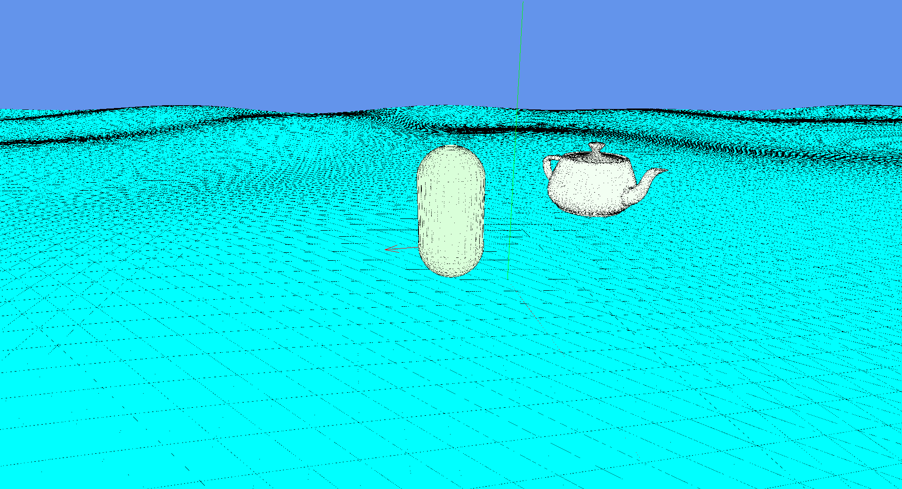

Throwaway code for a throwaway game engine

stb is sourced as a submodule. Be sure to `git clone --recursive` as you
clone this repo, or if you already have,
``git submodule update --init --recursive`.

```
$ gcc -o nob nob.c
$ ./nob
```


